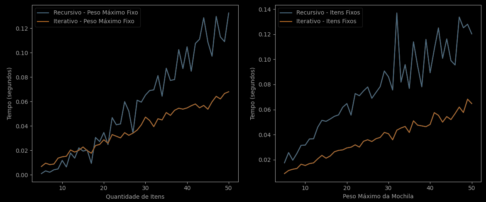

# Análise de algoritmos

Repositório com o trabalho final da disciplina Análise de algoritmos do curso Ciências da computação 5º semestre do IFCE Maracanaú

O trabalho é um código em Python que resolve o problema da mochila usando dois algoritmos diferentes: recursivo com memoização e iterativo. O problema da mochila consiste em escolher um subconjunto de itens com pesos e valores, de forma a maximizar o valor total sem exceder a capacidade da mochila.

## Algoritmos

- Recursivo com Memoização: Este algoritmo usa uma técnica de programação dinâmica que consiste em armazenar os resultados de subproblemas já resolvidos em uma tabela (memo), evitando recalculá-los.
- Iterativo: Este algoritmo usa uma abordagem bottom-up que preenche uma matriz (dp) com os valores ótimos dos subproblemas, partindo dos casos base até o problema original.

## Código

O código em Python está no arquivo `comparacao-tempos.py`. Ele usa as seguintes bibliotecas:

- random: para gerar os itens (peso/valor) com valores aleatórios
- matplotlib: para plotar os resultados em gráficos
- timeit: para medir a média do tempo de execução dos algoritmos para cada ponto dos gráficos

O código também varia a quantidade de itens e o peso máximo da mochila, para comparar o desempenho dos algoritmos. Ele executa cada algoritmo 100 vezes e calcula a média do tempo.

## Resultados

Os resultados obtidos pelo código são mostrados nos gráficos a seguir:

O gráfico 1 mostra o tempo de execução dos algoritmos em função da quantidade de itens, mantendo o peso máximo da mochila fixo em 50. O gráfico 2 mostra o tempo de execução dos algoritmos em função do peso máximo da mochila, mantendo a quantidade de itens fixa em 50.

Podemos observar que o algoritmo recursivo com memoização tem um tempo de execução maior que o algoritmo iterativo em ambos os gráficos.
